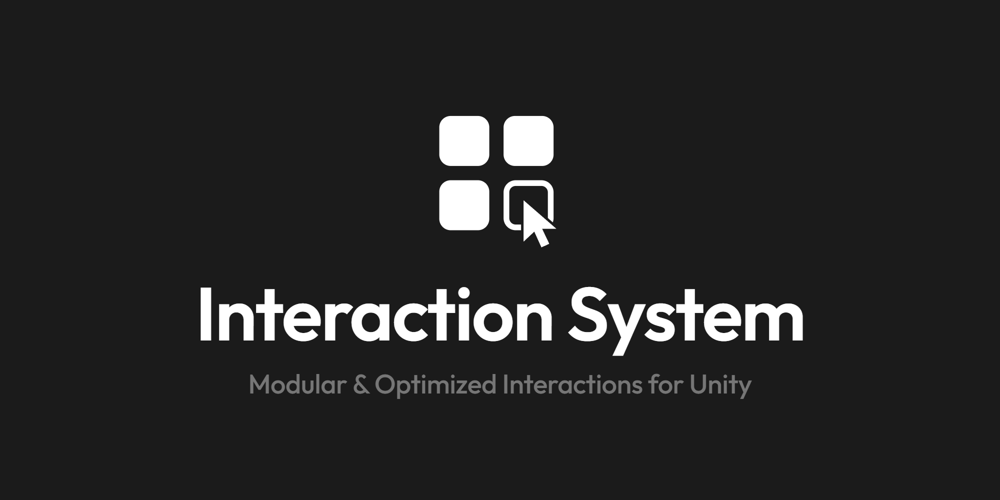
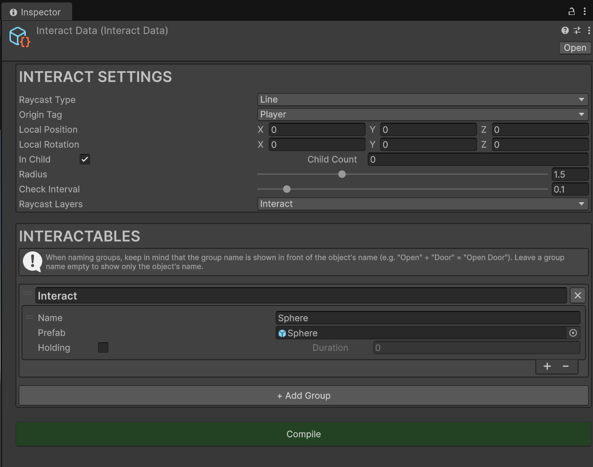
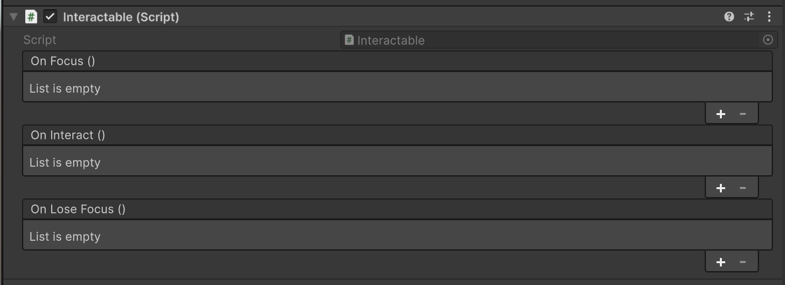

# InteractionSystem

Modular, event-driven interaction system for Unity.



## Overview

InteractionSystem detects what the player is looking at (or standing next to) and lets them interact
with it - press or hold a key, show a prompt like **Open Door**, run whatever you wire up. It has
**no `Update` and no coroutines**: detection runs on a cancellable **UniTask** loop at the rate you
choose, input comes from **Input System** callbacks, and every moment of an interaction is published
as an event.

Everything is configured in a single `InteractData` asset: detection settings on top, your
interactable prefabs below, each with the prompt it shows. One click on **Compile** makes every listed prefab
interactable - component, collider, layer and settings included.

## Features

- **No `Update`, no coroutines**: a UniTask detection loop with a configurable check interval
- **Line or Sphere detection**: a line for first-person (anything in front, like a wall, blocks it)
  or a sphere for third-person (the closest interactable in range wins)
- **Flexible origin**: pick the object by tag, optionally one of its children, then offset it with a
  local position and rotation
- **One-click Compile**: adds an `Interactable` component (only if missing), a `BoxCollider` (only if
  the object has no collider) and the `Interact` layer (created automatically), and skips prefabs that
  are already up to date
- **Whole-sentence prompts**: each object's name is shown exactly as written (`Take Battery`), so
  with [LocalizationSystem](https://github.com/fatihgezerx/LocalizationSystem) (optional) it is
  translated as one sentence (`Bataryayı al`), not word by word
- **Hold to interact** per object, with live progress for UI (e.g. a slider) and a timer that resets
  when the key is released or the object loses focus
- **Two ways to react**: `UnityEvent`s on each `Interactable` for no-code wiring, and allocation-free
  `EventManager` events (`FocusEvent`, `InteractEvent`...) for code
- **Ready-made prompt UI** with [UniMVC](https://github.com/fatihgezerx/UniMVC) (optional): a popup that
  shows the focused object's name, added to your MVC folder on its own (see [UI](#ui))
- **Scene view gizmo**: the line or sphere is drawn yellow while nothing is detected, green while
  something is
- Drag-to-reorder interactables in the Inspector

## Setup

### Requirements

- Unity 2022.3 LTS or newer (developed on Unity 6)

| Dependency | Why |
|---|---|
| [EventSystem](https://github.com/fatihgezerx/EventSystem) | Publishes `FocusEvent`, `LoseFocusEvent`, `InteractEvent` and `InteractingEvent` |
| [UniTask](https://github.com/Cysharp/UniTask) | The detection loop and holds run on UniTask, with no `Update` |
| **The new Input System** (1.8 or newer, for project-wide actions) | The `Interact` action |
| [UniMVC](https://github.com/fatihgezerx/UniMVC) (optional) | The ready-made interaction prompt (see [UI](#ui)) |
| [LocalizationSystem](https://github.com/fatihgezerx/LocalizationSystem) (optional) | Translating object names (see [Localization](#localization)) |

### Installation

Clone or download this repository, then copy its contents into a folder under `Assets/` (e.g.
`Assets/Scripts/InteractionSystem/`). The system comes with its own assembly definitions.

**Importing it never breaks your project.** A small setup script (with no dependencies of its own)
checks for the packages above. While one is missing, InteractionSystem is simply left out of
compilation, so there are no errors, and a dialog offers to install what's missing in one click (if you pick **Not now**, it asks
again in the next editor session or when InteractionSystem is imported again). Once everything is installed, the system
compiles on its own.

EventSystem and UniMVC are downloaded into `Assets/Scripts/EventSystem/` and `Assets/Scripts/MVC/`,
exactly as if you had copied them there, so their files stay visible and editable. UniTask and the Input System are installed through the Package
Manager. To install them yourself instead: copy [EventSystem](https://github.com/fatihgezerx/EventSystem)
into `Assets/Scripts/EventSystem/`, and add UniTask in `Window > Package Manager > + > Add package from
git URL...` with:

```
https://github.com/Cysharp/UniTask.git?path=src/UniTask/Assets/Plugins/UniTask
```

### Input (important)

This system works with the **new Input System**. For it to work, the project-wide input actions
(**Project Settings > Input System Package > Project-wide Actions**) must contain an action named
**`Interact`**. Assign whatever key you want to it (e.g. `E` on the keyboard, `Button West` on a
gamepad).

Interaction fires the moment the key is pressed, or after holding it for **Duration** seconds on
objects marked **Holding**. Holding is configured per object in `InteractData`, so you don't need
the **Hold** interaction that Unity's default template puts on `Interact`. You can remove it.

## Quick Start

**1. Create the data asset** via `Create > Interaction System > Interact Data`. Its Inspector has two
blocks: **INTERACT SETTINGS** and **INTERACTABLES**.

| Field | Meaning |
|---|---|
| Raycast Type | `Line` (FPS) or `Sphere` (TPS) |
| Origin Tag | Detection starts from the object with this tag |
| Local Position / Local Rotation | Where detection starts and which way the line points, relative to that object (its local space) |
| In Child / Child Count | If In Child is on, detection starts from the child at index Child Count instead (e.g. the camera under the player) |
| Radius | `Line`: length of the ray. `Sphere`: radius of the sphere (0.1 - 5) |
| Check Interval | Seconds between checks (0.01 - 1) |
| Raycast Layers | Only objects on these layers are detected |
| Interactables | The prefabs. Each has a **Name** (the prompt shown for it, empty = the prefab's name) and **Holding** / **Duration** |



`Line` never sees through anything: if an object that isn't on Raycast Layers (a wall) is in front
of an interactable, nothing is detected. `Sphere` detects every interactable within Radius, walls or
not, and focuses the closest one.

An object's **Name** is shown exactly as written, so write the whole prompt: `Open Door`,
`Take Battery`. Keeping it one sentence is what lets a translation reorder it the way the other
language needs (`Take Battery` becomes `Bataryayı al` in Turkish, not `Al Batarya`).

**2. Drag your prefabs into the list and click Compile.** Every prefab gets:
- an `Interactable` component, only if it doesn't have one yet,
- a `BoxCollider`, only if it has no collider yet,
- the `Interact` layer (created automatically if it doesn't exist),
- its Name and Holding / Duration settings.

Compiling again after adding or changing entries only touches the prefabs that changed.



**3. Initialize once, e.g. from your GameManager:**

```csharp
using InteractionSystem;
using UnityEngine;

public class GameManager : MonoBehaviour
{
    [SerializeField] private InteractData interactData;

    private void Start() => InteractionManager.Initialize(interactData);
    private void OnDestroy() => InteractionManager.Shutdown();
}
```

The object with the Origin Tag must exist in the scene when `Initialize` is called. While the game
is running, the Scene view draws the line or the sphere: **yellow** while nothing is detected,
**green** while something is.

## Events

Each `Interactable` has three `UnityEvent`s, wired from the Inspector:

- **On Focus**: the object started being detected
- **On Interact**: Interact was pressed (or held for Duration) while the object is focused
- **On Lose Focus**: the object stopped being detected

For example, with [PoolSystem](https://github.com/fatihgezerx/PoolSystem), drag a pooled object's
`Poolable` into **On Interact** and pick `ReleaseSelf` to return it to its pool when interacted with.

The same moments are also published through `EventManager` as `FocusEvent`, `LoseFocusEvent` and
`InteractEvent`, each carrying the `Interactable` as `Target`. No shared enum has to be edited: the events
are declared by InteractionSystem itself.

| `e.Target.` | Example | Meaning |
|---|---|---|
| `DisplayName` | `Take Battery` | The object's Name, ready for UI (the prefab's name if left empty) |
| `Holding` / `HoldDuration` | `true` / `2` | Hold settings |

```csharp
private void OnEnable()  => EventManager.Register<FocusEvent>(OnFocus);
private void OnDisable() => EventManager.Unregister<FocusEvent>(OnFocus);

private void OnFocus(FocusEvent e) => promptLabel.text = e.Target.DisplayName; // "Take Battery"
```

## UI

With [UniMVC](https://github.com/fatihgezerx/UniMVC), a ready-made prompt that shows the focused object's
name is added to your project. The setup script copies these views into your MVC folder on its own,
creating the subfolders as needed: right away if UniMVC is already in the project when you import
InteractionSystem, or as soon as UniMVC is added later (by you or by the setup dialog). They become your
own project code, so edit them freely. Existing files are never overwritten, and a view you delete isn't
brought back unless InteractionSystem or UniMVC is imported again. Until everything InteractionSystem
needs is installed, and again if you remove InteractionSystem later, the views compile to nothing, so
they never cause errors.

| File | Base | What it does |
|---|---|---|
| `Controllers/InteractionController` | `ControllerBase` | Listens to `FocusEvent` / `LoseFocusEvent` / `InteractingEvent` and opens / closes / fills the popup |
| `Popups/InteractionPopup` | `PopupViewBase` | The prompt: filled with the focused object and shown on focus, hidden on lose focus |
| `Texts/InteractionText` | `TextViewBase` | The prompt's label: the object's Name (`Take Battery`), translated with LocalizationSystem |
| `Sliders/InteractionSlider` | `SliderViewBase` | The hold progress: shown only for Holding objects, fills from 0 to 1 over their Duration |

**Setup:**

1. Put `InteractionController` on the Canvas that has the `UIManager`.
2. Create the popup under the Canvas: an object with `InteractionPopup`, and inside it a TextMeshPro text
   with `InteractionText` and, if you use Holding objects, a Slider with `InteractionSlider`. The slider's
   range is set to 0-1 by code. Leave the popup inactive.
3. Press **Collect From Children** on the popup and on the `UIManager`: the text goes into the popup's
   Texts, the slider into its Sliders, the popup into the `UIManager`'s Popups and the controller into its
   Controllers.
4. Call `UIManager.Initialize()` from your bootstrap code.

`InteractionSlider` needs no tween or loop of its own: it follows `InteractingEvent`, whose timer already
runs in `InteractionManager` (see [Holding](#holding)), so it always matches the real hold and empties as
soon as the key is released or the object loses focus.

The popup can also sit inside another panel's list, but if it is inside that panel in the hierarchy
too, it only becomes visible while that panel is open.

## Pausing

`InteractionManager.Pause(by)` stops detection until `InteractionManager.Resume(by)`: nothing is focused (the
current object loses focus, so its prompt goes) and Interact does nothing. `by` is any object standing for
the reason - a menu, a cutscene - so several can pause at once, and detection runs again once every one of
them resumed. `InteractionManager.IsPaused` says whether it stands by.

With [UniMVC](https://github.com/fatihgezerx/UniMVC) in the project it also pauses by itself while a panel or
popup with **Blocks Gameplay** ticked is open (UniMVC's `UIBlocking`) - e.g. an inventory window or a pause
menu - and resumes once the last one closes. No code needed.

## Localization

With [LocalizationSystem](https://github.com/fatihgezerx/LocalizationSystem) in the project, every
object's Name becomes translatable: after **Compile**, **Sync Project** in LocalizationSystem's
Language Data window finds the Names on the interactable prefabs and adds each one as a row, so it is
translated as one sentence. The UI's `InteractionText` then shows the Name in the current language and
follows language changes, even while the popup is closed. If the popup is open when the language changes,
`InteractionController` resizes it to the new text in the same frame (UniMVC's `RebuildLayoutLater`). In
your own code, show
`LocalizationRuntime.Get(e.Target.DisplayName)` instead of `e.Target.DisplayName`.

It is optional: without LocalizationSystem, InteractionSystem compiles and shows the Names as written.
Install it later and the Names become translatable on their own, no change needed. `InteractionText`
keeps its object marked with `ExcludeFromLocalization`, since its text is filled by code.

## Holding

For a **Holding** object, Interact must be held for **Duration** seconds. The timer resets if the
key is released or the object loses focus. `On Focus` fires only once per object until it loses
focus, so moving the aim around on the same object never restarts the timer.

While a Holding object is being held, `InteractingEvent` is published with `Elapsed` = seconds held
so far:
- with 0 when the key is pressed,
- every frame while it is held,
- with 0 again when the hold ends (key released, focus lost, or completed right after `InteractEvent`).

With UniMVC, `InteractionSlider` (see [UI](#ui)) already does this. Without it, for example a hold
slider in your own UI: the maximum comes from the focused object, the current value from
`InteractingEvent`. No `Update` is needed:

```csharp
using EventSystem;
using InteractionSystem;
using UnityEngine;
using UnityEngine.UI;

public class HoldSlider : MonoBehaviour
{
    [SerializeField] private Slider slider;

    private void OnEnable()
    {
        EventManager.Register<FocusEvent>(OnFocus);
        EventManager.Register<LoseFocusEvent>(OnLoseFocus);
        EventManager.Register<InteractingEvent>(OnInteracting);
    }

    private void OnDisable()
    {
        EventManager.Unregister<FocusEvent>(OnFocus);
        EventManager.Unregister<LoseFocusEvent>(OnLoseFocus);
        EventManager.Unregister<InteractingEvent>(OnInteracting);
    }

    private void OnFocus(FocusEvent e)
    {
        slider.gameObject.SetActive(e.Target.Holding);
        slider.maxValue = e.Target.HoldDuration;
        slider.value = 0f;
    }

    private void OnLoseFocus(LoseFocusEvent e) => slider.gameObject.SetActive(false);

    private void OnInteracting(InteractingEvent e) => slider.value = e.Elapsed;
}
```

Every event is a `readonly struct`, so publishing `InteractingEvent` every frame never allocates.

## License

[MIT License](LICENSE)
